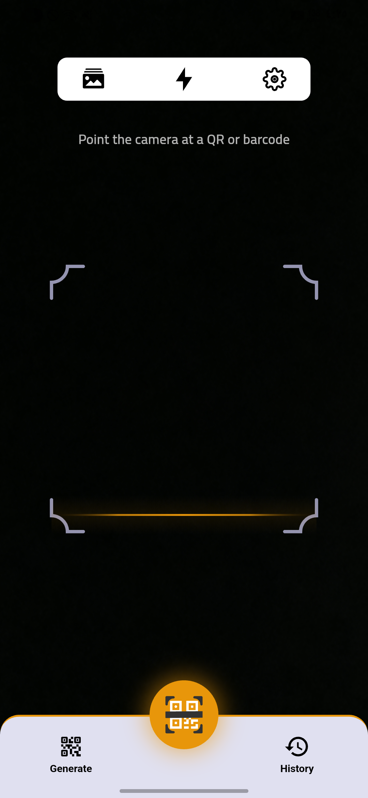
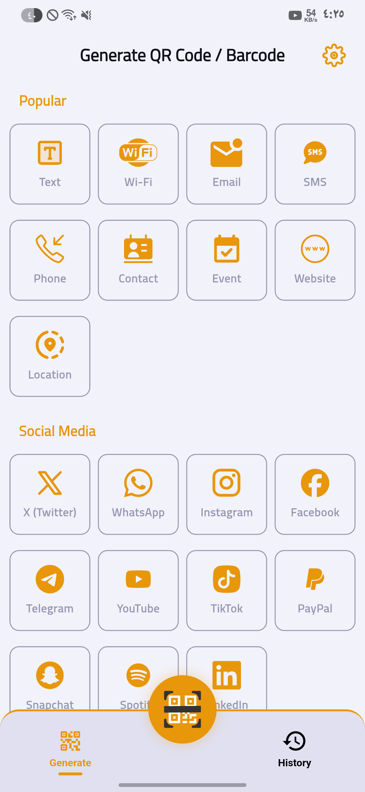
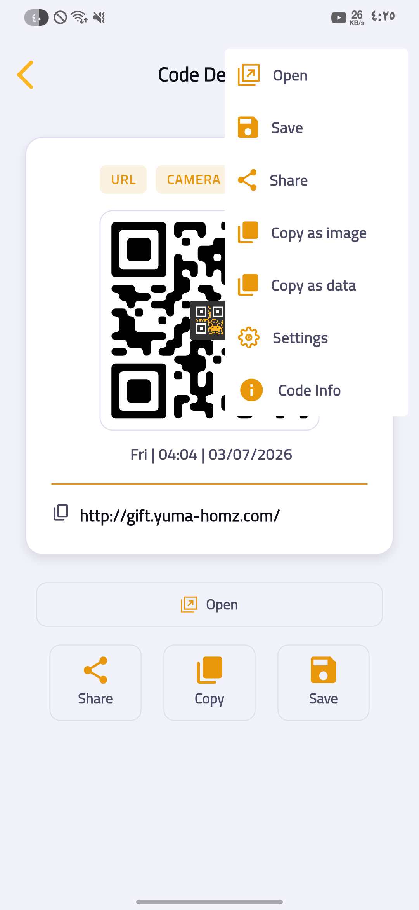
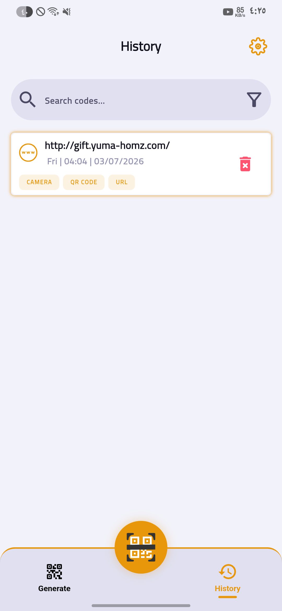
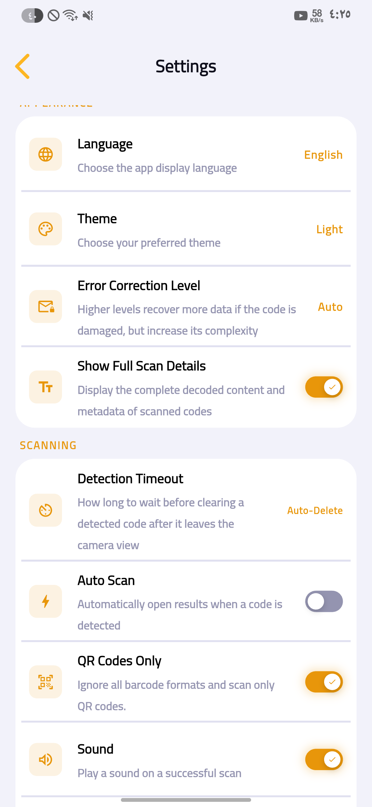

# Scanify

Scanify is a Flutter app for scanning, generating, and managing QR codes and barcodes. It supports live camera scanning, gallery-image scanning, rich QR/barcode generation for a wide range of content types (URLs, Wi-Fi, contacts, calendar events, locations, social profiles, and more), a searchable scan history, and per-item actions like opening, sharing, saving, and copying.

## Features

- **Scan** — real-time camera scanning with auto-detection, multi-code detection, torch control, tap-to-focus, and gallery-image scanning (with automatic PNG→JPEG conversion to work around a known MLKit decoding limitation).
- **Generate** — build QR codes and barcodes for: plain text, websites, Wi-Fi networks, contacts (vCard), email, SMS, phone numbers, calendar events, geographic locations (with an embedded interactive map picker), and social profiles (WhatsApp, Telegram, Twitter/X, Instagram, Facebook, YouTube, TikTok, PayPal, Snapchat, Spotify, LinkedIn).
- **History** — locally persisted (Hive) scan/generate history with favorites, filtering, and auto-delete policies.
- **Details view** — open the underlying action (launch URL, dial number, add to calendar, save contact, etc.), share the code image, save to gallery, or copy the image/text to the clipboard.
- **Location picker** — a reusable, embeddable map widget (OpenStreetMap-style tiles via CartoDB, `flutter_map` + `geolocator` + `geocoding`) for picking or displaying coordinates, with reverse geocoding, address search, and current-location support.
- **Settings** — theme (light/dark/system), language (English/Arabic, fully localized RTL-aware UI), sound & haptic feedback, auto-scan, auto-clear detection delay, auto-delete history window, and QR error-correction level.
- **Notifications** — Android notification channels for camera-active state, history changes, and save confirmations (via `awesome_notifications`).

## Showcase

> Screenshots below are placeholders —  `screenshots/`

| Scan | Generate | Details |
|---|---|---|
|  |  |  |

| History | Settings |
|---|---|
|  |  |

Suggested shots to capture: the Scan tab mid-detection (with the focus-frame animation active), the Generate tab's tool grid, a filled-out generate form (e.g. Wi-Fi or contact), the Details screen for a URL code, the History list with a couple of favorited items, the location picker dialog with a pin placed, and Settings in both light and dark theme.

## Demo Video

> No video is linked yet


## Requirements

- Flutter SDK compatible with Dart `^3.9.2`
- Android minimum SDK 21+ (see `flutter_launcher_icons` config) / a recent iOS target
- A physical device or emulator with camera support for scanning features
- Internet access for map tiles and address geocoding (the location picker degrades gracefully — with a tile-error overlay — when offline)

## Installation

1. **Clone the repository**
   ```
   git clone https://github.com/Jo0X01/Scanify
   cd scanify
   ```

2. **Install dependencies**
   ```
   flutter pub get
   ```

3. **Generate localization files** (if not already present — the project uses Flutter's built-in `generate: true` localization pipeline)
   ```
   flutter gen-l10n
   ```

4. **Run the app**
   ```
   flutter run
   ```

### Platform permissions

Scanify requests the following at runtime (handled by `PermissionService`):

| Permission | Required? | Purpose |
|---|---|---|
| Camera | Required | Live QR/barcode scanning |
| Notifications | Required | Camera-active / history / save notifications |
| Storage / Photos | Optional | Saving generated codes to the gallery, picking images to scan |
| Location | Optional | Location-based QR generation and the "my location" map action |

Make sure your platform manifests (`AndroidManifest.xml` / `Info.plist`) declare the corresponding native permission entries expected by `permission_handler`, `geolocator`, `image_picker`, and `awesome_notifications` — see each package's setup docs for the exact keys.

## Usage

**Scanning:** open the app to the Scan tab (default), point the camera at a QR code or barcode, or tap the gallery icon to scan from an existing photo. Detected codes navigate to the Details screen automatically once selected.

**Generating:** switch to the Generate tab, pick a content type (text, URL, Wi-Fi, contact, event, location, social, etc.), fill in the type-specific form, and the app renders a live QR/barcode preview you can save, share, or copy.

**History:** previously scanned or generated codes are saved locally (subject to the "enable history" and auto-delete settings) and browsable from the History tab, with support for marking favorites and deleting individual entries.

**Location picker (for integrators):** the `lib/shared/location_picker/` package is self-contained and reusable in other screens/projects:
```dart
LocationPickerDialog.show(
  context,
  initialValue: LocationPickerResult(),
  onApply: (result) => setState(() => _pickedLocation = result),
);
```
or embed `LocationPickerMapWidget` directly for an inline (non-dialog) picker.

## Project structure

```
lib/
├── app/            # App bootstrap (AppInit, ScanifyApp/MaterialApp shell)
├── core/            # Cross-cutting: services, managers, models, enums, l10n, utils
├── features/        # Feature modules (scan, generate, history, details, settings, splash, app_section)
└── shared/          # Reusable widgets and the standalone location_picker package
```

The codebase follows a feature-first structure with a service/manager layer (`ScannerService` → `ScannerManager`, `LocationPickerService` → `LocationPickerController`) separating platform/plugin calls from state exposed to the UI via `ValueNotifier`/`ChangeNotifier`.

## Key dependencies

| Package | Purpose |
|---|---|
| `mobile_scanner` | Camera-based barcode/QR detection |
| `pretty_qr_code`, `barcode_widget` | QR/barcode rendering |
| `hive`, `hive_flutter` | Local persistent storage for scan/generate history |
| `flutter_map`, `latlong2`, `geolocator`, `geocoding` | Location picker map, positioning, and geocoding |
| `permission_handler`, `device_info_plus` | Runtime permission management |
| `awesome_notifications` | Local notifications |
| `share_plus`, `pasteboard`, `screenshot` | Sharing and copying generated code images |
| `image_picker`, `file_picker`, `image` | Gallery image selection and format conversion |
| `flutter_contacts`, `add_2_calendar`, `url_launcher` | Executing scanned-code actions (save contact, add event, open link) |
| `shared_preferences` | Persisting user settings |
| `flutter_localizations`, `intl` | English/Arabic localization |

See `pubspec.yaml` for the complete, versioned dependency list.

## Contributing

Contributions are welcome. Please:
1. Open an issue describing the bug or feature before starting significant work.
2. Follow the existing feature-first module structure and the service/manager/controller separation used throughout `lib/core` and `lib/features`.
3. Run `flutter analyze` and ensure `flutter_lints` passes before submitting a PR.
4. Keep PRs focused — one fix or feature per PR is easier to review.

## License

Licensed under the **GNU General Public License v3.0 (GPL-3.0)**. See [`LICENSE`](LICENSE) for the full text.

In short: you're free to use, modify, and redistribute this project, but any distributed derivative work must also be licensed under GPL-3.0 and its source made available.